# 16 全系统流程泳道图

本文将鲸选美学 CRM 的主要业务、外部协作和系统支撑流程统一表示为泳道图。依据为当前 PRD、状态机、角色权限、实际接口及功能清单；流程状态与限制以仓库最新实现为准。

## 1. 阅读说明

- 使用 Mermaid `sequenceDiagram`：**每个参与者列就是一条泳道**，箭头表示职责交接、系统调用或事实写入，虚线表示响应/结果。
- `alt` 表示互斥分支，`opt` 表示可选环节，`loop` 表示重复执行，`Note` 表示不可绕过的约束或现状边界。
- 覆盖有明确业务动作、状态变化或跨角色协作的流程。单纯列表查询、详情查看、分页、列设置不逐页重复成图，但仍受登录与数据权限流程约束。
- 除匿名外部回调外，写操作默认经过后端 RBAC、租户与数据范围校验；需要防重的命令携带幂等键，需要防并发覆盖的表单携带 `version`，并按领域要求校验 CSRF、记录审计。
- 图中“CRM”包含后端应用服务与 MySQL 事务，不表示把所有职责放进 Controller；MySQL 是业务事实源，Redis 和 Kafka 不代替账本。
- “模拟/Mock”只验证内部链路，不代表真实供应商授权、真实资金到账或生产验收。公开知识问答、个人微信采集、AI 自动确认资金/核销均不是现有能力。

### 流程地图

| 分类 | 覆盖流程 |
|---|---|
| 经营主链路 | 获客 → 建档 → 跟进 → 下单支付 → 权益 → 预约核销 → 退款/结算 → 回访与经营分析 |
| 客户与任务 | 登录访问、建档与积分、跟进任务、查重合并、合并更正、归属转交 |
| 产品与交易 | 套餐/SKU、手工订单、有赞订单、预约核销、核销冲正、退款 |
| 机构与合作 | 机构准入与敏感变更、合同资质、展示资料、结算付款、活动渠道归因 |
| 外部与智能 | 企微客户资料、企微会话归档、AI 证据提取与人工确认 |
| 内容与运营 | 文件、素材、知识资料、报表大屏、导出、风控与对账 |
| 系统与运维 | 用户角色权限、字典、Outbox/Kafka/Inbox、数据迁移、备份恢复与发布 |

## 2. 端到端经营履约总览

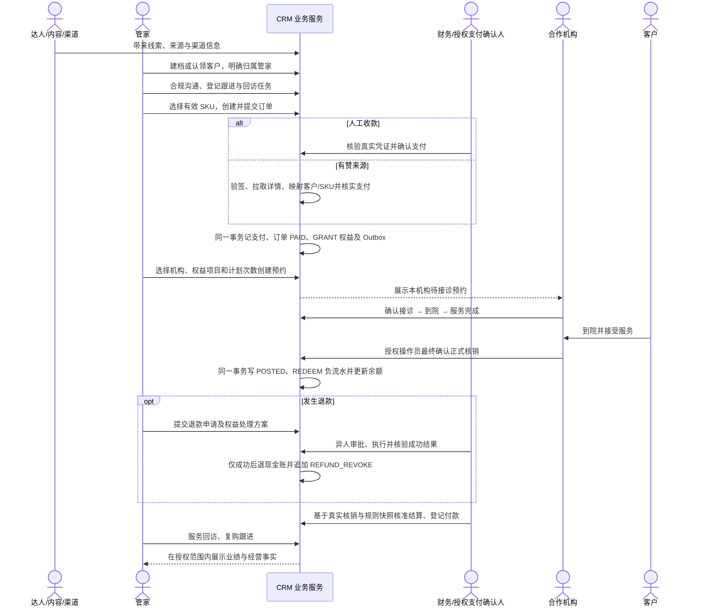
```mermaid
sequenceDiagram
  actor CH as 达人/内容/渠道
  actor M as 管家
  participant CRM as CRM 业务服务
  actor F as 财务/授权支付确认人
  actor I as 合作机构
  actor C as 客户

  CH->>CRM: 带来线索、来源与渠道信息
  M->>CRM: 建档或认领客户，明确归属管家
  M->>CRM: 合规沟通、登记跟进与回访任务
  M->>CRM: 选择有效 SKU，创建并提交订单
  alt 人工收款
    F->>CRM: 核验真实凭证并确认支付
  else 有赞来源
    CRM->>CRM: 验签、拉取详情、映射客户/SKU并核实支付
  end
  CRM->>CRM: 同一事务记支付、订单 PAID、GRANT 权益及 Outbox
  M->>CRM: 选择机构、权益项目和计划次数创建预约
  CRM-->>I: 展示本机构待接诊预约
  I->>CRM: 确认接诊 → 到院 → 服务完成
  C->>I: 到院并接受服务
  I->>CRM: 授权操作员最终确认正式核销
  CRM->>CRM: 同一事务写 POSTED、REDEEM 负流水并更新余额
  opt 发生退款
    M->>CRM: 提交退款申请及权益处理方案
    F->>CRM: 异人审批、执行并核验成功结果
    CRM->>CRM: 仅成功后退现金账并追加 REFUND_REVOKE
  end
  F->>CRM: 基于真实核销与规则快照核准结算、登记付款
  M->>CRM: 服务回访、复购跟进
  CRM-->>M: 在授权范围内展示业绩与经营事实
```

**主线不变量：**支付确认前无可用权益；预约不提前扣次数；只有机构授权操作员正式核销才扣减；只有真实退款成功才累计退款并回收权益。

## 3. 客户、任务与访问流程

### 3.1 登录、会话恢复、访问控制与退出

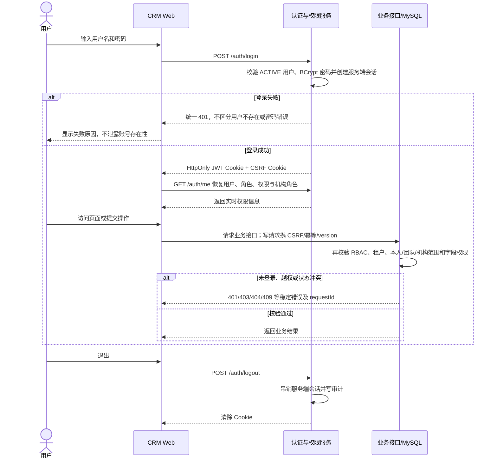
```mermaid
sequenceDiagram
  actor U as 用户
  participant W as CRM Web
  participant A as 认证与权限服务
  participant B as 业务接口/MySQL

  U->>W: 输入用户名和密码
  W->>A: POST /auth/login
  A->>A: 校验 ACTIVE 用户、BCrypt 密码并创建服务端会话
  alt 登录失败
    A-->>W: 统一 401，不区分用户不存在或密码错误
    W-->>U: 显示失败原因，不泄露账号存在性
  else 登录成功
    A-->>W: HttpOnly JWT Cookie + CSRF Cookie
    W->>A: GET /auth/me 恢复用户、角色、权限与机构角色
    A-->>W: 返回实时权限信息
    U->>W: 访问页面或提交操作
    W->>B: 请求业务接口；写请求携 CSRF/幂等/version
    B->>B: 再校验 RBAC、租户、本人/团队/机构范围和字段权限
    alt 未登录、越权或状态冲突
      B-->>W: 401/403/404/409 等稳定错误及 requestId
    else 校验通过
      B-->>W: 返回业务结果
    end
  end
  U->>W: 退出
  W->>A: POST /auth/logout
  A->>A: 吊销服务端会话并写审计
  A-->>W: 清除 Cookie
```

### 3.2 客户建档、身份关联与积分调整

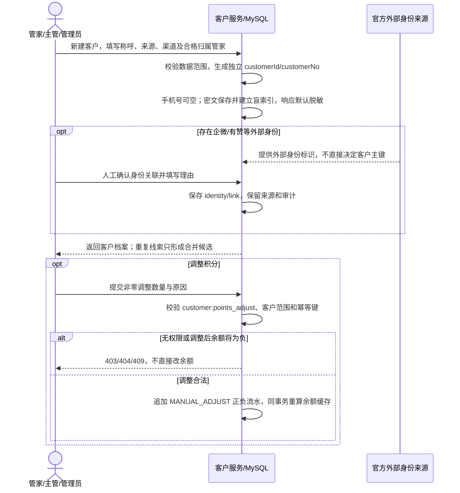
```mermaid
sequenceDiagram
  actor M as 管家/主管/管理员
  participant CRM as 客户服务/MySQL
  participant EXT as 官方外部身份来源

  M->>CRM: 新建客户，填写称呼、来源、渠道及合格归属管家
  CRM->>CRM: 校验数据范围，生成独立 customerId/customerNo
  CRM->>CRM: 手机号可空；密文保存并建立盲索引，响应默认脱敏
  opt 存在企微/有赞等外部身份
    EXT-->>CRM: 提供外部身份标识，不直接决定客户主键
    M->>CRM: 人工确认身份关联并填写理由
    CRM->>CRM: 保存 identity/link，保留来源和审计
  end
  CRM-->>M: 返回客户档案；重复线索只形成合并候选
  opt 调整积分
    M->>CRM: 提交非零调整数量与原因
    CRM->>CRM: 校验 customer:points_adjust、客户范围和幂等键
    alt 无权限或调整后余额将为负
      CRM-->>M: 403/404/409，不直接改余额
    else 调整合法
      CRM->>CRM: 追加 MANUAL_ADJUST 正负流水，同事务重算余额缓存
    end
  end
```

> 客户唯一 ID 不等于手机号、昵称或外部平台身份。Q12 的积分规则未确认前，不做自动消费积分推断。

### 3.3 跟进登记与任务接手、转派、退回、完成

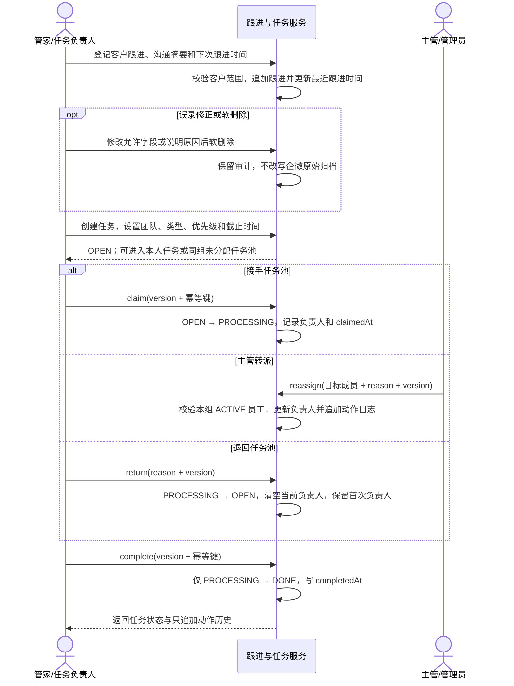
```mermaid
sequenceDiagram
  actor M as 管家/任务负责人
  participant CRM as 跟进与任务服务
  actor L as 主管/管理员

  M->>CRM: 登记客户跟进、沟通摘要和下次跟进时间
  CRM->>CRM: 校验客户范围，追加跟进并更新最近跟进时间
  opt 误录修正或软删除
    M->>CRM: 修改允许字段或说明原因后软删除
    CRM->>CRM: 保留审计，不改写企微原始归档
  end
  M->>CRM: 创建任务，设置团队、类型、优先级和截止时间
  CRM-->>M: OPEN；可进入本人任务或同组未分配任务池
  alt 接手任务池
    M->>CRM: claim(version + 幂等键)
    CRM->>CRM: OPEN → PROCESSING，记录负责人和 claimedAt
  else 主管转派
    L->>CRM: reassign(目标成员 + reason + version)
    CRM->>CRM: 校验本组 ACTIVE 员工，更新负责人并追加动作日志
  else 退回任务池
    M->>CRM: return(reason + version)
    CRM->>CRM: PROCESSING → OPEN，清空当前负责人，保留首次负责人
  end
  M->>CRM: complete(version + 幂等键)
  CRM->>CRM: 仅 PROCESSING → DONE，写 completedAt
  CRM-->>M: 返回任务状态与只追加动作历史
```

### 3.4 客户查重、审核与合并

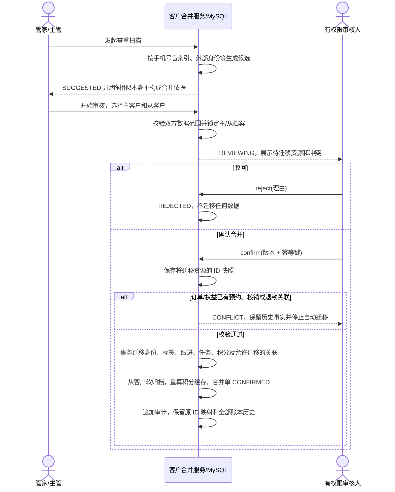
```mermaid
sequenceDiagram
  actor M as 管家/主管
  participant CRM as 客户合并服务/MySQL
  actor R as 有权限审核人

  M->>CRM: 发起查重扫描
  CRM->>CRM: 按手机号盲索引、外部身份等生成候选
  CRM-->>M: SUGGESTED；昵称相似本身不构成合并依据
  M->>CRM: 开始审核，选择主客户和从客户
  CRM->>CRM: 校验双方数据范围并锁定主/从档案
  CRM-->>R: REVIEWING，展示待迁移资源和冲突
  alt 驳回
    R->>CRM: reject(理由)
    CRM->>CRM: REJECTED，不迁移任何数据
  else 确认合并
    R->>CRM: confirm(版本 + 幂等键)
    CRM->>CRM: 保存将迁移资源的 ID 快照
    alt 订单/权益已有预约、核销或退款关联
      CRM-->>R: CONFLICT，保留历史事实并停止自动迁移
    else 校验通过
      CRM->>CRM: 事务迁移身份、标签、跟进、任务、积分及允许迁移的关联
      CRM->>CRM: 从客户软归档，重算积分缓存，合并单 CONFIRMED
      CRM->>CRM: 追加审计，保留原 ID 映射和全部账本历史
    end
  end
```

### 3.5 错误合并更正

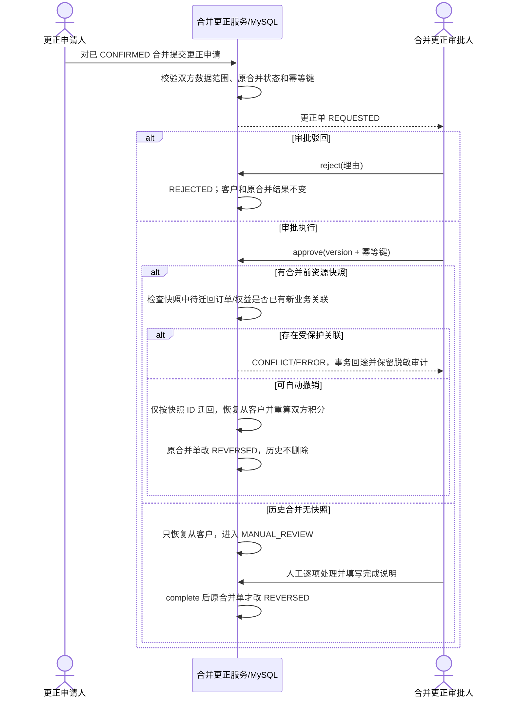
```mermaid
sequenceDiagram
  actor A as 更正申请人
  participant CRM as 合并更正服务/MySQL
  actor R as 合并更正审批人

  A->>CRM: 对已 CONFIRMED 合并提交更正申请
  CRM->>CRM: 校验双方数据范围、原合并状态和幂等键
  CRM-->>R: 更正单 REQUESTED
  alt 审批驳回
    R->>CRM: reject(理由)
    CRM->>CRM: REJECTED；客户和原合并结果不变
  else 审批执行
    R->>CRM: approve(version + 幂等键)
    alt 有合并前资源快照
      CRM->>CRM: 检查快照中待迁回订单/权益是否已有新业务关联
      alt 存在受保护关联
        CRM-->>R: CONFLICT/ERROR，事务回滚并保留脱敏审计
      else 可自动撤销
        CRM->>CRM: 仅按快照 ID 迁回，恢复从客户并重算双方积分
        CRM->>CRM: 原合并单改 REVERSED，历史不删除
      end
    else 历史合并无快照
      CRM->>CRM: 只恢复从客户，进入 MANUAL_REVIEW
      R->>CRM: 人工逐项处理并填写完成说明
      CRM->>CRM: complete 后原合并单才改 REVERSED
    end
  end
```

> 主客户原有及合并后新增的数据不会被全量迁回；去重删除的身份/标签不能自动恢复。支付金额、权益发放和核销历史不被覆盖。

### 3.6 客户归属转交

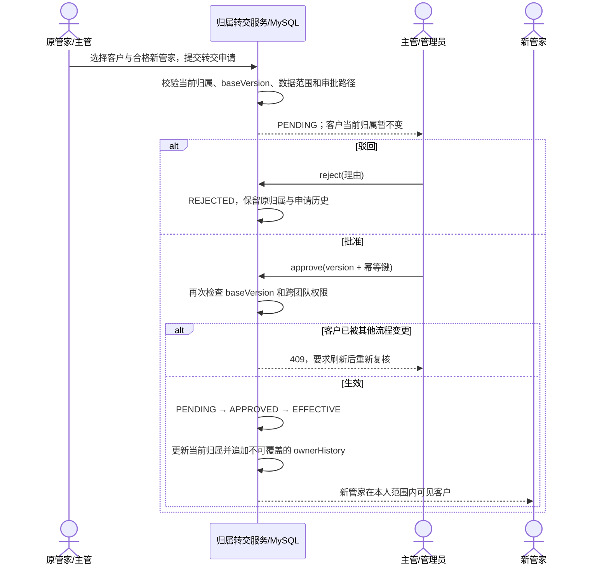
```mermaid
sequenceDiagram
  actor M as 原管家/主管
  participant CRM as 归属转交服务/MySQL
  actor A as 主管/管理员
  actor N as 新管家

  M->>CRM: 选择客户与合格新管家，提交转交申请
  CRM->>CRM: 校验当前归属、baseVersion、数据范围和审批路径
  CRM-->>A: PENDING；客户当前归属暂不变
  alt 驳回
    A->>CRM: reject(理由)
    CRM->>CRM: REJECTED，保留原归属与申请历史
  else 批准
    A->>CRM: approve(version + 幂等键)
    CRM->>CRM: 再次检查 baseVersion 和跨团队权限
    alt 客户已被其他流程变更
      CRM-->>A: 409，要求刷新后重新复核
    else 生效
      CRM->>CRM: PENDING → APPROVED → EFFECTIVE
      CRM->>CRM: 更新当前归属并追加不可覆盖的 ownerHistory
      CRM-->>N: 新管家在本人范围内可见客户
    end
  end
```

> 历史订单继续保留成交时的销售与归属快照，不因后续转交改写业绩事实。

## 4. 产品、交易与履约流程

### 4.1 产品、套餐、SKU 上架与停售

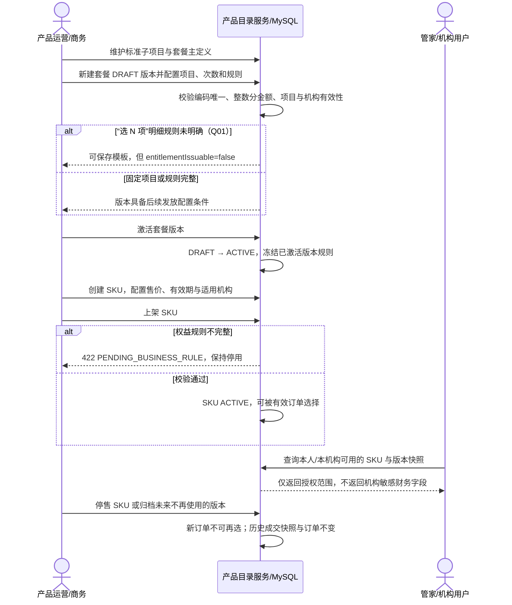
```mermaid
sequenceDiagram
  actor O as 产品运营/商务
  participant CRM as 产品目录服务/MySQL
  actor M as 管家/机构用户

  O->>CRM: 维护标准子项目与套餐主定义
  O->>CRM: 新建套餐 DRAFT 版本并配置项目、次数和规则
  CRM->>CRM: 校验编码唯一、整数分金额、项目与机构有效性
  alt “选 N 项”明细规则未明确（Q01）
    CRM-->>O: 可保存模板，但 entitlementIssuable=false
  else 固定项目或规则完整
    CRM-->>O: 版本具备后续发放配置条件
  end
  O->>CRM: 激活套餐版本
  CRM->>CRM: DRAFT → ACTIVE，冻结已激活版本规则
  O->>CRM: 创建 SKU，配置售价、有效期与适用机构
  O->>CRM: 上架 SKU
  alt 权益规则不完整
    CRM-->>O: 422 PENDING_BUSINESS_RULE，保持停用
  else 校验通过
    CRM->>CRM: SKU ACTIVE，可被有效订单选择
  end
  M->>CRM: 查询本人/本机构可用的 SKU 与版本快照
  CRM-->>M: 仅返回授权范围，不返回机构敏感财务字段
  O->>CRM: 停售 SKU 或归档未来不再使用的版本
  CRM->>CRM: 新订单不可再选；历史成交快照与订单不变
```

> Q02 分摊权重未配置时保存待分摊标识并阻断相关金额结算，不阻断合规的目录维护。低频或质量提示只辅助运营，不自动下架。

### 4.2 手工订单、支付确认与权益发放

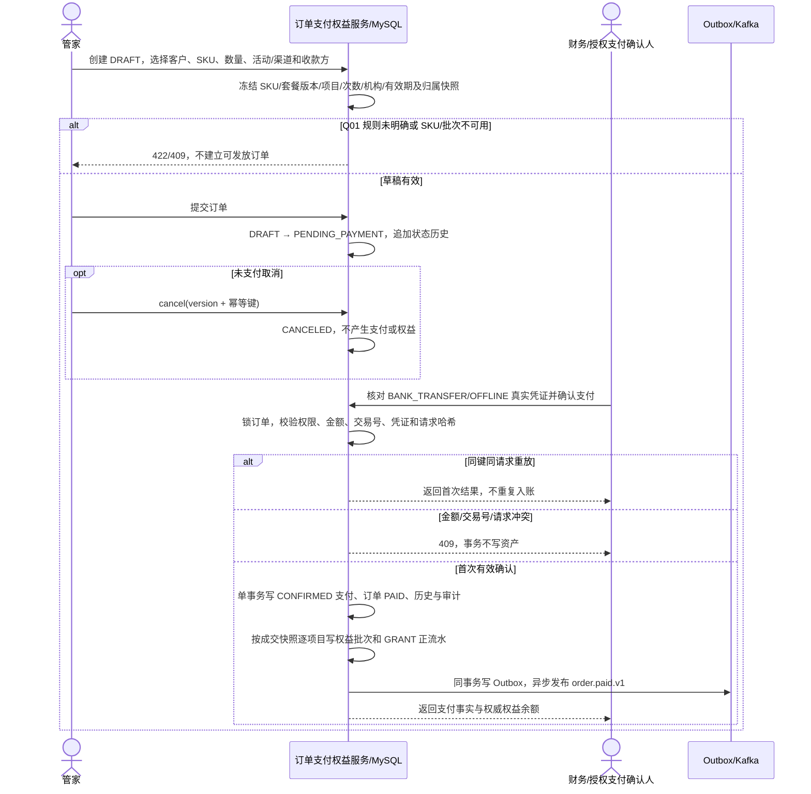
```mermaid
sequenceDiagram
  actor M as 管家
  participant CRM as 订单支付权益服务/MySQL
  actor F as 财务/授权支付确认人
  participant K as Outbox/Kafka

  M->>CRM: 创建 DRAFT，选择客户、SKU、数量、活动/渠道和收款方
  CRM->>CRM: 冻结 SKU/套餐版本/项目/次数/机构/有效期及归属快照
  alt Q01 规则未明确或 SKU/批次不可用
    CRM-->>M: 422/409，不建立可发放订单
  else 草稿有效
    M->>CRM: 提交订单
    CRM->>CRM: DRAFT → PENDING_PAYMENT，追加状态历史
    opt 未支付取消
      M->>CRM: cancel(version + 幂等键)
      CRM->>CRM: CANCELED，不产生支付或权益
    end
    F->>CRM: 核对 BANK_TRANSFER/OFFLINE 真实凭证并确认支付
    CRM->>CRM: 锁订单，校验权限、金额、交易号、凭证和请求哈希
    alt 同键同请求重放
      CRM-->>F: 返回首次结果，不重复入账
    else 金额/交易号/请求冲突
      CRM-->>F: 409，事务不写资产
    else 首次有效确认
      CRM->>CRM: 单事务写 CONFIRMED 支付、订单 PAID、历史与审计
      CRM->>CRM: 按成交快照逐项目写权益批次和 GRANT 正流水
      CRM->>K: 同事务写 Outbox，异步发布 order.paid.v1
      CRM-->>F: 返回支付事实与权威权益余额
    end
  end
```

> 已支付订单的金额、项目和成交快照不能通过普通编辑覆盖。管家不能自行确认支付，AI 也不能触发此流程。

### 4.3 有赞订单同步、映射与异常补偿

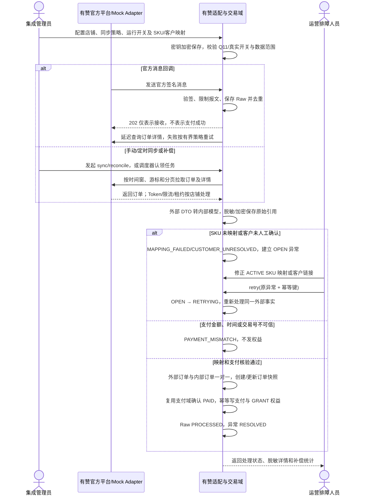
```mermaid
sequenceDiagram
  actor A as 集成管理员
  participant Y as 有赞官方平台/Mock Adapter
  participant CRM as 有赞适配与交易域
  actor O as 运营排障人员

  A->>CRM: 配置店铺、同步策略、运行开关及 SKU/客户映射
  CRM->>CRM: 密钥加密保存，校验 Q11/真实开关与数据范围
  alt 官方消息回调
    Y->>CRM: 发送官方签名消息
    CRM->>CRM: 验签、限制报文、保存 Raw 并去重
    CRM-->>Y: 202 仅表示接收，不表示支付成功
    CRM->>Y: 延迟查询订单详情，失败按有界策略重试
  else 手动/定时同步或补偿
    A->>CRM: 发起 sync/reconcile，或调度器认领任务
    CRM->>Y: 按时间窗、游标和分页拉取订单及详情
    Y-->>CRM: 返回订单；Token/限流/租约按店铺处理
  end
  CRM->>CRM: 外部 DTO 转内部模型，脱敏/加密保存原始引用
  alt SKU 未映射或客户未人工确认
    CRM->>CRM: MAPPING_FAILED/CUSTOMER_UNRESOLVED，建立 OPEN 异常
    O->>CRM: 修正 ACTIVE SKU 映射或客户链接
    O->>CRM: retry(原异常 + 幂等键)
    CRM->>CRM: OPEN → RETRYING，重新处理同一外部事实
  else 支付金额、时间或交易号不可信
    CRM->>CRM: PAYMENT_MISMATCH，不发权益
  else 映射和支付核验通过
    CRM->>CRM: 外部订单与内部订单一对一，创建/更新订单快照
    CRM->>CRM: 复用支付域确认 PAID，幂等写支付与 GRANT 权益
    CRM->>CRM: Raw PROCESSED，异常 RESOLVED
  end
  CRM-->>O: 返回处理状态、脱敏详情和补偿统计
```

> 当前默认 Mock/禁用真实接入；真实店铺尚未完成 Q11 授权联调。重复回调与主动拉单不能重复发权益，旧外部状态不能覆盖已支付事实；本流程不包含有赞真实退款同步。

### 4.4 预约、接诊、到院、服务与正式核销

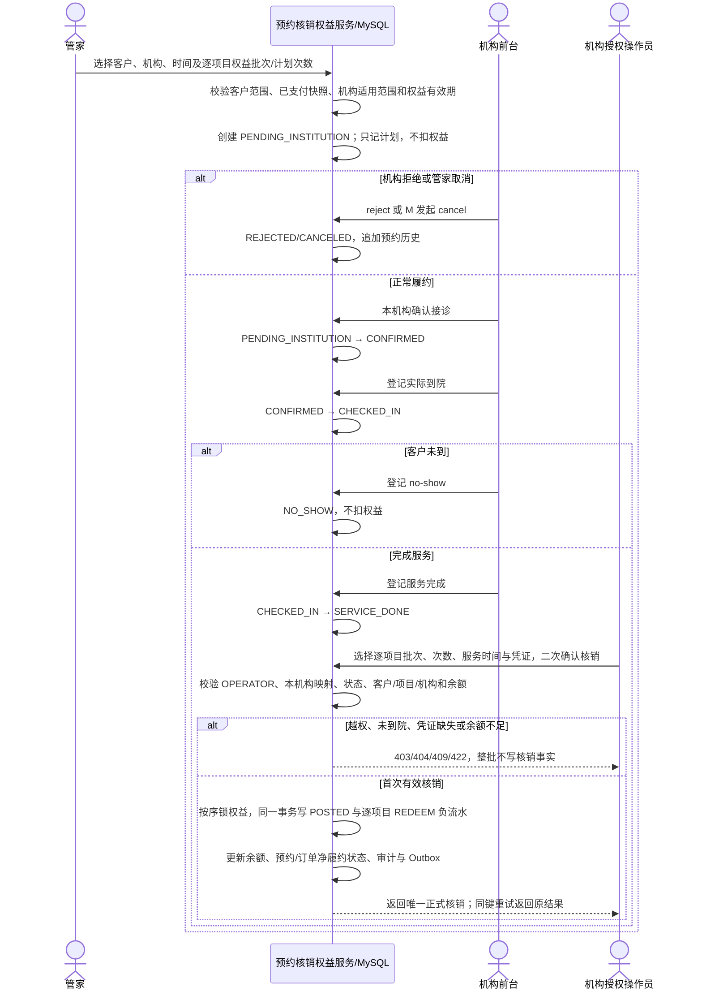
```mermaid
sequenceDiagram
  actor M as 管家
  participant CRM as 预约核销权益服务/MySQL
  actor F as 机构前台
  actor O as 机构授权操作员

  M->>CRM: 选择客户、机构、时间及逐项目权益批次/计划次数
  CRM->>CRM: 校验客户范围、已支付快照、机构适用范围和权益有效期
  CRM->>CRM: 创建 PENDING_INSTITUTION；只记计划，不扣权益
  alt 机构拒绝或管家取消
    F->>CRM: reject 或 M 发起 cancel
    CRM->>CRM: REJECTED/CANCELED，追加预约历史
  else 正常履约
    F->>CRM: 本机构确认接诊
    CRM->>CRM: PENDING_INSTITUTION → CONFIRMED
    F->>CRM: 登记实际到院
    CRM->>CRM: CONFIRMED → CHECKED_IN
    alt 客户未到
      F->>CRM: 登记 no-show
      CRM->>CRM: NO_SHOW，不扣权益
    else 完成服务
      F->>CRM: 登记服务完成
      CRM->>CRM: CHECKED_IN → SERVICE_DONE
      O->>CRM: 选择逐项目批次、次数、服务时间与凭证，二次确认核销
      CRM->>CRM: 校验 OPERATOR、本机构映射、状态、客户/项目/机构和余额
      alt 越权、未到院、凭证缺失或余额不足
        CRM-->>O: 403/404/409/422，整批不写核销事实
      else 首次有效核销
        CRM->>CRM: 按序锁权益，同一事务写 POSTED 与逐项目 REDEEM 负流水
        CRM->>CRM: 更新余额、预约/订单净履约状态、审计与 Outbox
        CRM-->>O: 返回唯一正式核销；同键重试返回原结果
      end
    end
  end
```

> 管理员、管家和机构前台都不能直接正式核销。聊天或 AI 中“已做完服务”的陈述只是线索，不等于到院或 POSTED 事实。

### 4.5 已核销冲正

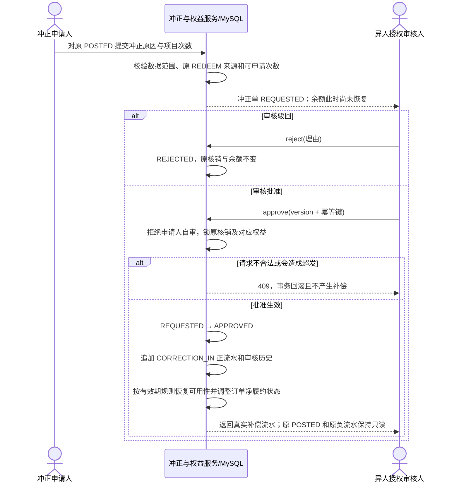
```mermaid
sequenceDiagram
  actor A as 冲正申请人
  participant CRM as 冲正与权益服务/MySQL
  actor R as 异人授权审核人

  A->>CRM: 对原 POSTED 提交冲正原因与项目次数
  CRM->>CRM: 校验数据范围、原 REDEEM 来源和可申请次数
  CRM-->>R: 冲正单 REQUESTED；余额此时尚未恢复
  alt 审核驳回
    R->>CRM: reject(理由)
    CRM->>CRM: REJECTED，原核销与余额不变
  else 审核批准
    R->>CRM: approve(version + 幂等键)
    CRM->>CRM: 拒绝申请人自审，锁原核销及对应权益
    alt 请求不合法或会造成超发
      CRM-->>R: 409，事务回滚且不产生补偿
    else 批准生效
      CRM->>CRM: REQUESTED → APPROVED
      CRM->>CRM: 追加 CORRECTION_IN 正流水和审核历史
      CRM->>CRM: 按有效期规则恢复可用性并调整订单净履约状态
      CRM-->>R: 返回真实补偿流水；原 POSTED 和原负流水保持只读
    end
  end
```

### 4.6 退款申请、审批、执行与权益回收

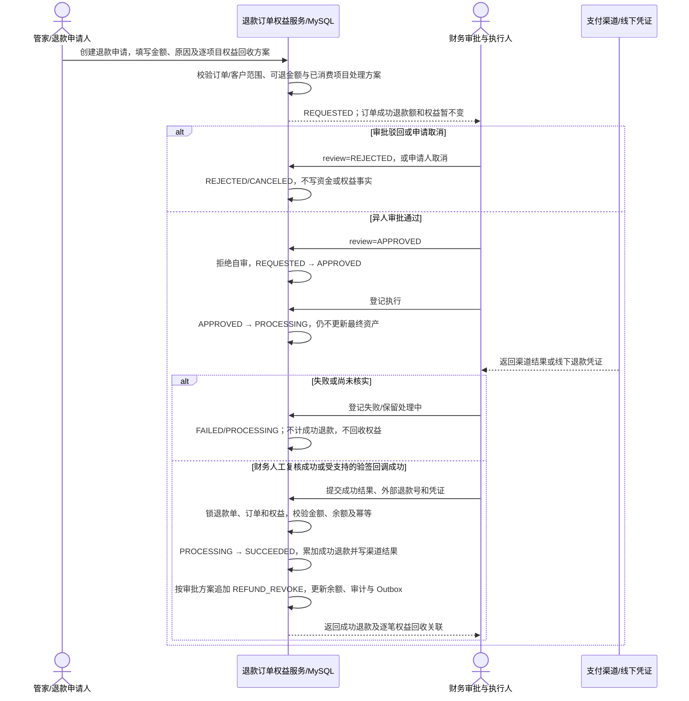
```mermaid
sequenceDiagram
  actor M as 管家/退款申请人
  participant CRM as 退款订单权益服务/MySQL
  actor F as 财务审批与执行人
  participant P as 支付渠道/线下凭证

  M->>CRM: 创建退款申请，填写金额、原因及逐项目权益回收方案
  CRM->>CRM: 校验订单/客户范围、可退金额与已消费项目处理方案
  CRM-->>F: REQUESTED；订单成功退款额和权益暂不变
  alt 审批驳回或申请取消
    F->>CRM: review=REJECTED，或申请人取消
    CRM->>CRM: REJECTED/CANCELED，不写资金或权益事实
  else 异人审批通过
    F->>CRM: review=APPROVED
    CRM->>CRM: 拒绝自审，REQUESTED → APPROVED
    F->>CRM: 登记执行
    CRM->>CRM: APPROVED → PROCESSING，仍不更新最终资产
    P-->>F: 返回渠道结果或线下退款凭证
    alt 失败或尚未核实
      F->>CRM: 登记失败/保留处理中
      CRM->>CRM: FAILED/PROCESSING；不计成功退款，不回收权益
    else 财务人工复核成功或受支持的验签回调成功
      F->>CRM: 提交成功结果、外部退款号和凭证
      CRM->>CRM: 锁退款单、订单和权益，校验金额、余额及幂等
      CRM->>CRM: PROCESSING → SUCCEEDED，累加成功退款并写渠道结果
      CRM->>CRM: 按审批方案追加 REFUND_REVOKE，更新余额、审计与 Outbox
      CRM-->>F: 返回成功退款及逐笔权益回收关联
    end
  end
```

> 已消费项目退款不会自动归还次数；Q06 未确认的回收比例不由系统猜测。若渠道已成功但权益回收发生竞争异常，应进入财务补偿异常，不能把成功回执改写成失败。

## 5. 机构合作与结算流程

### 5.1 机构准入、普通资料与敏感变更审批

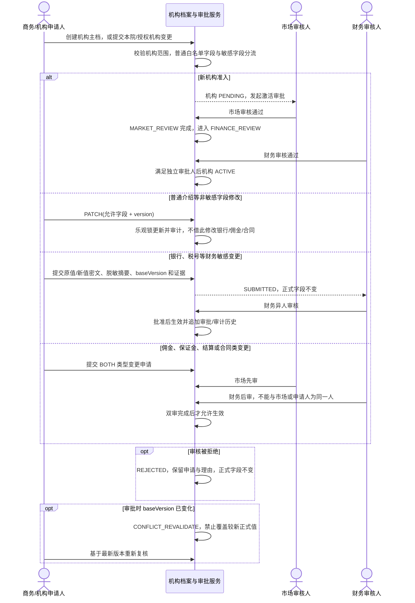
```mermaid
sequenceDiagram
  actor A as 商务/机构申请人
  participant CRM as 机构档案与审批服务
  actor M as 市场审核人
  actor F as 财务审核人

  A->>CRM: 创建机构主档，或提交本院/授权机构变更
  CRM->>CRM: 校验机构范围，普通白名单字段与敏感字段分流
  alt 新机构准入
    CRM-->>M: 机构 PENDING，发起激活审批
    M->>CRM: 市场审核通过
    CRM->>CRM: MARKET_REVIEW 完成，进入 FINANCE_REVIEW
    F->>CRM: 财务审核通过
    CRM->>CRM: 满足独立审批人后机构 ACTIVE
  else 普通介绍等非敏感字段修改
    A->>CRM: PATCH(允许字段 + version)
    CRM->>CRM: 乐观锁更新并审计，不借此修改银行/佣金/合同
  else 银行、税号等财务敏感变更
    A->>CRM: 提交原值/新值密文、脱敏摘要、baseVersion 和证据
    CRM-->>F: SUBMITTED，正式字段不变
    F->>CRM: 财务异人审核
    CRM->>CRM: 批准后生效并追加审批/审计历史
  else 佣金、保证金、结算或合同类变更
    A->>CRM: 提交 BOTH 类型变更申请
    M->>CRM: 市场先审
    F->>CRM: 财务后审，不能与市场或申请人为同一人
    CRM->>CRM: 双审完成后才允许生效
  end
  opt 审核被拒绝
    CRM->>CRM: REJECTED，保留申请与理由，正式字段不变
  end
  opt 审批时 baseVersion 已变化
    CRM->>CRM: CONFLICT_REVALIDATE，禁止覆盖较新正式值
    A->>CRM: 基于最新版本重新复核
  end
```

> 具体字段审批矩阵仍以 Q08 决策为准；申请人不能审核本人申请，市场与财务不能越序或相互代审。

### 5.2 机构合同版本与资质审核

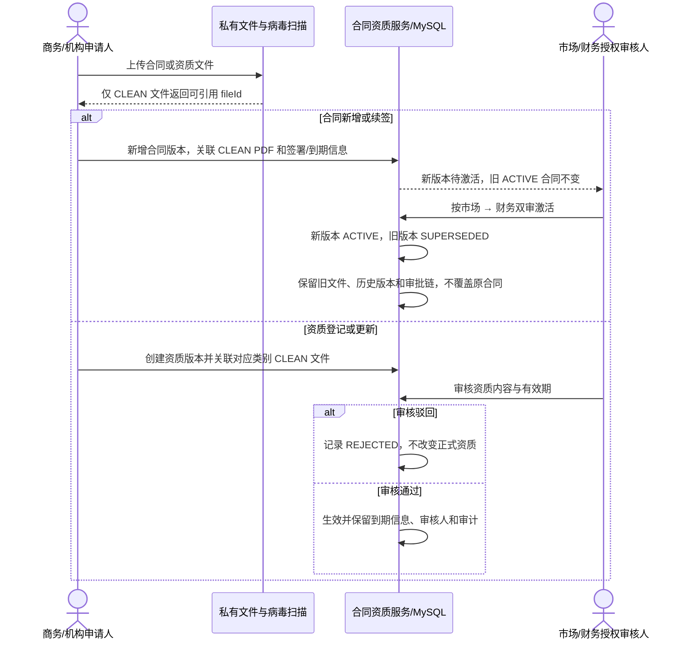
```mermaid
sequenceDiagram
  actor A as 商务/机构申请人
  participant FS as 私有文件与病毒扫描
  participant CRM as 合同资质服务/MySQL
  actor R as 市场/财务授权审核人

  A->>FS: 上传合同或资质文件
  FS-->>A: 仅 CLEAN 文件返回可引用 fileId
  alt 合同新增或续签
    A->>CRM: 新增合同版本，关联 CLEAN PDF 和签署/到期信息
    CRM-->>R: 新版本待激活，旧 ACTIVE 合同不变
    R->>CRM: 按市场 → 财务双审激活
    CRM->>CRM: 新版本 ACTIVE，旧版本 SUPERSEDED
    CRM->>CRM: 保留旧文件、历史版本和审批链，不覆盖原合同
  else 资质登记或更新
    A->>CRM: 创建资质版本并关联对应类别 CLEAN 文件
    R->>CRM: 审核资质内容与有效期
    alt 审核驳回
      CRM->>CRM: 记录 REJECTED，不改变正式资质
    else 审核通过
      CRM->>CRM: 生效并保留到期信息、审核人和审计
    end
  end
```

### 5.3 机构展示资料维护与一页纸查看

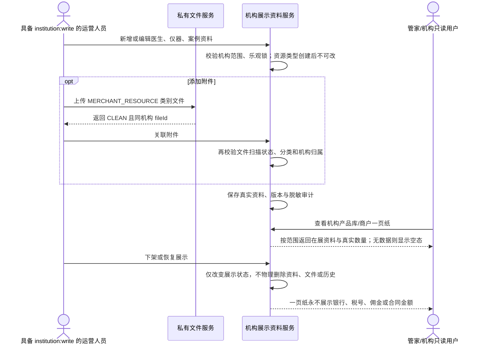
```mermaid
sequenceDiagram
  actor O as 具备 institution:write 的运营人员
  participant FS as 私有文件服务
  participant CRM as 机构展示资料服务
  actor V as 管家/机构只读用户

  O->>CRM: 新增或编辑医生、仪器、案例资料
  CRM->>CRM: 校验机构范围、乐观锁；资源类型创建后不可改
  opt 添加附件
    O->>FS: 上传 MERCHANT_RESOURCE 类别文件
    FS-->>O: 返回 CLEAN 且同机构 fileId
    O->>CRM: 关联附件
    CRM->>CRM: 再校验文件扫描状态、分类和机构归属
  end
  CRM->>CRM: 保存真实资料、版本与脱敏审计
  V->>CRM: 查看机构产品库/商户一页纸
  CRM-->>V: 按范围返回在展资料与真实数量；无数据则显示空态
  O->>CRM: 下架或恢复展示
  CRM->>CRM: 仅改变展示状态，不物理删除资料、文件或历史
  CRM-->>V: 一页纸永不展示银行、税号、佣金或合同金额
```

### 5.4 机构结算、人工核准与分次付款

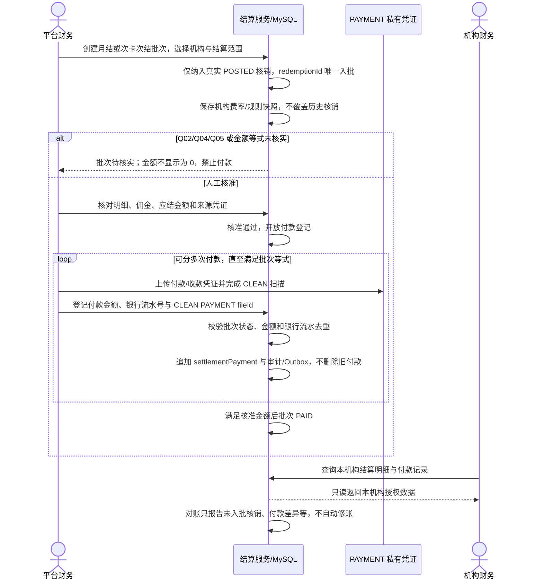
```mermaid
sequenceDiagram
  actor F as 平台财务
  participant CRM as 结算服务/MySQL
  participant FS as PAYMENT 私有凭证
  actor IF as 机构财务

  F->>CRM: 创建月结或次卡次结批次，选择机构与结算范围
  CRM->>CRM: 仅纳入真实 POSTED 核销，redemptionId 唯一入批
  CRM->>CRM: 保存机构费率/规则快照，不覆盖历史核销
  alt Q02/Q04/Q05 或金额等式未核实
    CRM-->>F: 批次待核实；金额不显示为 0，禁止付款
  else 人工核准
    F->>CRM: 核对明细、佣金、应结金额和来源凭证
    CRM->>CRM: 核准通过，开放付款登记
    loop 可分多次付款，直至满足批次等式
      F->>FS: 上传付款/收款凭证并完成 CLEAN 扫描
      F->>CRM: 登记付款金额、银行流水号与 CLEAN PAYMENT fileId
      CRM->>CRM: 校验批次状态、金额和银行流水去重
      CRM->>CRM: 追加 settlementPayment 与审计/Outbox，不删除旧付款
    end
    CRM->>CRM: 满足核准金额后批次 PAID
  end
  IF->>CRM: 查询本机构结算明细与付款记录
  CRM-->>IF: 只读返回本机构授权数据
  CRM->>CRM: 对账只报告未入批核销、付款差异等，不自动修账
```

### 5.5 活动、渠道与订单归因

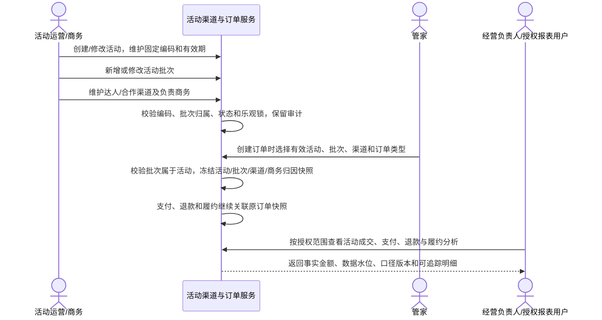
```mermaid
sequenceDiagram
  actor O as 活动运营/商务
  participant CRM as 活动渠道与订单服务
  actor M as 管家
  actor R as 经营负责人/授权报表用户

  O->>CRM: 创建/修改活动，维护固定编码和有效期
  O->>CRM: 新增或修改活动批次
  O->>CRM: 维护达人/合作渠道及负责商务
  CRM->>CRM: 校验编码、批次归属、状态和乐观锁，保留审计
  M->>CRM: 创建订单时选择有效活动、批次、渠道和订单类型
  CRM->>CRM: 校验批次属于活动，冻结活动/批次/渠道/商务归因快照
  CRM->>CRM: 支付、退款和履约继续关联原订单快照
  R->>CRM: 按授权范围查看活动成交、支付、退款与履约分析
  CRM-->>R: 返回事实金额、数据水位、口径版本和可追踪明细
```

> 后续修改活动名称、渠道负责人或停用字典，不改写历史订单快照。Q13 未确认的转化率不计算。

## 6. 企业微信与 AI 流程

### 6.1 企微客户资料全量、回调与每日对账

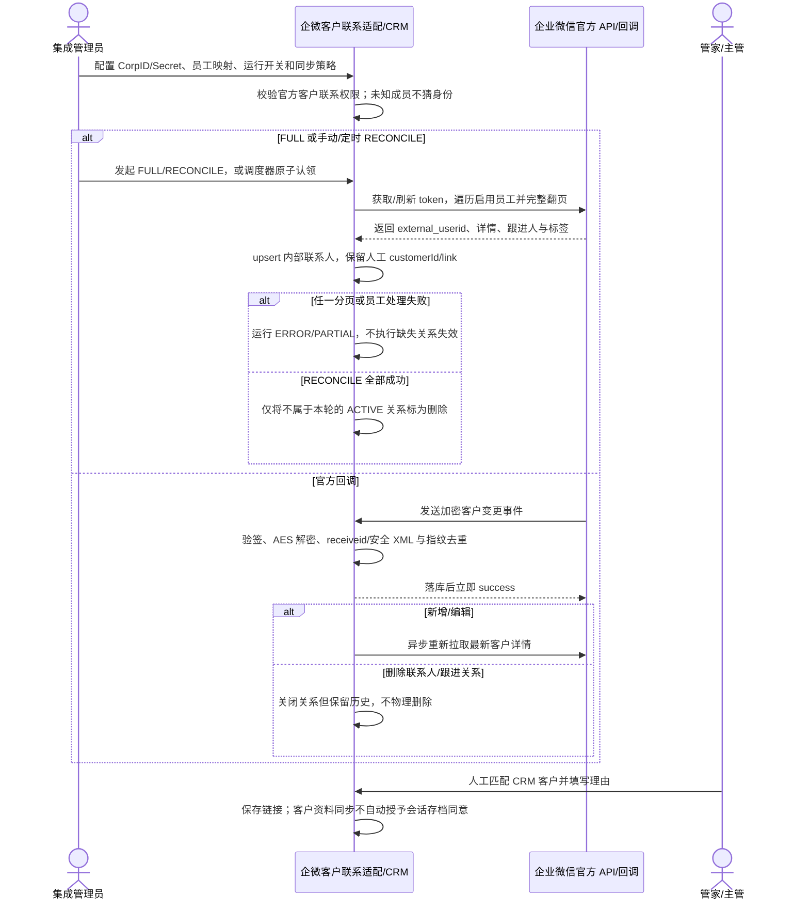
```mermaid
sequenceDiagram
  actor A as 集成管理员
  participant CRM as 企微客户联系适配/CRM
  participant W as 企业微信官方 API/回调
  actor M as 管家/主管

  A->>CRM: 配置 CorpID/Secret、员工映射、运行开关和同步策略
  CRM->>CRM: 校验官方客户联系权限；未知成员不猜身份
  alt FULL 或手动/定时 RECONCILE
    A->>CRM: 发起 FULL/RECONCILE，或调度器原子认领
    CRM->>W: 获取/刷新 token，遍历启用员工并完整翻页
    W-->>CRM: 返回 external_userid、详情、跟进人与标签
    CRM->>CRM: upsert 内部联系人，保留人工 customerId/link
    alt 任一分页或员工处理失败
      CRM->>CRM: 运行 ERROR/PARTIAL，不执行缺失关系失效
    else RECONCILE 全部成功
      CRM->>CRM: 仅将不属于本轮的 ACTIVE 关系标为删除
    end
  else 官方回调
    W->>CRM: 发送加密客户变更事件
    CRM->>CRM: 验签、AES 解密、receiveid/安全 XML 与指纹去重
    CRM-->>W: 落库后立即 success
    alt 新增/编辑
      CRM->>W: 异步重新拉取最新客户详情
    else 删除联系人/跟进关系
      CRM->>CRM: 关闭关系但保留历史，不物理删除
    end
  end
  M->>CRM: 人工匹配 CRM 客户并填写理由
  CRM->>CRM: 保存链接；客户资料同步不自动授予会话存档同意
```

> 真实企业授权、公网回调及生产联调尚未完成。企微客户资料同步成功不等于会话存档成功，也不等于 CRM 客户唯一身份已自动确认。

### 6.2 企微会话归档、缺采监控与正文读取

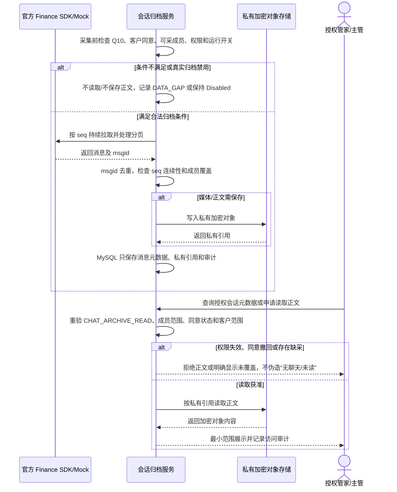
```mermaid
sequenceDiagram
  participant W as 官方 Finance SDK/Mock
  participant CRM as 会话归档服务
  participant S as 私有加密对象存储
  actor M as 授权管家/主管

  CRM->>CRM: 采集前检查 Q10、客户同意、可采成员、权限和运行开关
  alt 条件不满足或真实归档禁用
    CRM->>CRM: 不读取/不保存正文，记录 DATA_GAP 或保持 Disabled
  else 满足合法归档条件
    CRM->>W: 按 seq 持续拉取并处理分页
    W-->>CRM: 返回消息及 msgid
    CRM->>CRM: msgid 去重，检查 seq 连续性和成员覆盖
    alt 媒体/正文需保存
      CRM->>S: 写入私有加密对象
      S-->>CRM: 返回私有引用
    end
    CRM->>CRM: MySQL 只保存消息元数据、私有引用和审计
  end
  M->>CRM: 查询授权会话元数据或申请读取正文
  CRM->>CRM: 重验 CHAT_ARCHIVE_READ、成员范围、同意状态和客户范围
  alt 权限失效、同意撤回或存在缺采
    CRM-->>M: 拒绝正文或明确显示未覆盖，不伪造“无聊天/未读”
  else 读取获准
    CRM->>S: 按私有引用读取正文
    S-->>CRM: 返回加密对象内容
    CRM-->>M: 最小范围展示并记录访问审计
  end
```

> 当前真实 Finance SDK 未接入，真实归档保持 Mock/Disabled。官方存档只能覆盖规定时间窗，未读回执也未接入，不能用沉默时间推断客户未读。

### 6.3 AI 证据抽取与人工确认

```mermaid
sequenceDiagram
  actor M as 管家/主管
  participant CRM as AI 任务与权限服务
  participant W as AI Worker
  participant L as 模型供应商/Mock 抽取器
  actor S as 主管质量复核人

  M->>CRM: 对授权会话创建证据提取/分析任务
  CRM->>CRM: 校验客户范围、会话同意、成员覆盖和时间范围
  CRM->>CRM: 创建异步任务并执行原子占用/超时回收
  CRM->>CRM: 执行前再次复核权限，只收集最小必要事实和消息引用
  alt 权限失效、同意撤回或执行开关关闭
    CRM-->>M: 任务终止/失败，不发送聊天内容
  else 允许执行
    CRM->>W: 发送脱敏上下文、Schema 和本次供应商配置
    W->>L: 调用严格受限的抽取接口
    L-->>W: 返回结构化建议与证据消息 ID
    W-->>CRM: 校验 Schema、证据/项目/机构白名单和禁止字段
    alt 结构、证据或来源校验失败
      CRM->>CRM: 记录脱敏失败并按有界策略重试或终止
    else 校验通过
      CRM->>CRM: 保存 PROPOSED 洞察，factStatus=UNVERIFIED
      M->>CRM: 展开证据，人工编辑后确认或驳回
      alt 人工确认
        CRM->>CRM: 只生成一条普通 FOLLOWUP 待办，来源唯一且幂等
      else 人工驳回
        CRM->>CRM: 保留驳回结果，不创建业务事实
      end
    end
  end
  S->>CRM: 查看授权范围内质量统计并抽样复核
  CRM-->>S: 返回建议质量信息，不把它当资金或履约事实
```

> AI 不能自动确认订单/支付、预约、正式核销、退款、合同或银行资料变更；回复草稿只能由人复制，不能自动发送。真实模型效果、成本和合规仍需独立验收。

### 6.4 大模型与知识库连接配置及测试

```mermaid
sequenceDiagram
  actor A as 系统管理员
  participant CRM as AI/知识配置服务
  participant W as AI Worker
  participant P as 模型或 Dify/Mock

  A->>CRM: 保存 disabled/mock/真实供应商配置、地址、模型和密钥
  CRM->>CRM: 校验租户、ai:config 或知识配置权限、version 与幂等键
  CRM->>CRM: API Key/Dataset Key 加密保存，响应不回显
  CRM-->>A: 保存后 UNVERIFIED，真实能力仍受 FEATURE 开关约束
  A->>CRM: 对已保存配置执行连接测试
  CRM->>W: 固定测试消息，服务端按需解密传递本次配置
  W->>P: 在允许的 HTTPS/内网策略下调用测试接口
  P-->>W: 返回固定结构响应或脱敏错误
  W-->>CRM: 返回 CONNECTED/FAILED 语义所需结果
  CRM->>CRM: 更新连接状态、最近成功时间、脱敏错误、version 和审计
  CRM-->>A: HTTP 200 时仍须读取 CONNECTED/FAILED
```

> 模型连接测试可能产生 Token 费用；Dify `CONNECTED` 不表示已有资料、检索质量或公开问答通过验收。公开知识问答当前未开放。

## 7. 内容、知识与运营治理流程

### 7.1 私有文件上传、安全扫描与授权下载

```mermaid
sequenceDiagram
  actor U as 有权限上传人
  participant CRM as 文件应用服务
  participant S as MinIO/S3 私有桶
  participant V as ClamAV/格式校验
  actor D as 下载人

  U->>CRM: upload-init(分类、文件名、MIME、大小)
  CRM->>CRM: 校验角色、业务分类、机构范围、类型与大小上限
  CRM->>S: 创建未完成元数据并申请短期预签名 PUT
  S-->>U: 返回私有上传地址
  U->>S: 直接上传对象
  U->>CRM: upload-complete(fileId、ETag/hash)
  CRM->>S: 读取对象并核验 ETag、大小、MIME、SHA-256
  CRM->>V: 扫描实际对象并解析格式
  alt 病毒、格式或哈希异常
    V-->>CRM: FOUND/BLOCKED/校验失败
    CRM-->>U: 409/422，不可被业务引用或下载
  else 扫描通过
    V-->>CRM: CLEAN
    CRM->>S: 服务端写入封存对象并原子发布元数据
    CRM-->>U: CLEAN fileId，可在对应业务表单中引用
  end
  D->>CRM: 请求预览/下载
  CRM->>CRM: 重新校验当前业务权限、数据范围、分类和扫描状态
  alt 无权或对象不安全
    CRM-->>D: 403/404/409，并记录拒绝审计
  else 校验通过
    CRM->>S: 生成短期签名 GET
    S-->>D: 下载对象，CRM 记录下载审计
  end
```

> PAYMENT 通用凭证还要求支付确认权限、客户 ALL 范围及相应订单读取权限，机构账号不能使用该通用路径；EXPORT 使用专用生成链路。附件更换通过新版本，不覆盖旧引用。

### 7.2 素材创建、版本送审、审核与下架

```mermaid
sequenceDiagram
  actor O as 素材运营/授权创建人
  participant CRM as 素材服务/MySQL
  actor R as 独立审核人
  actor M as 管家/普通读者

  O->>CRM: 创建素材主档与 DRAFT 修订
  O->>CRM: 关联 CLEAN MATERIAL 文件，维护分类、机构、项目、城市与标签
  O->>CRM: submit(revisionId + version + 幂等键)
  CRM->>CRM: 修订 DRAFT/REJECTED → PENDING，保留 changeNote
  CRM-->>R: 返回待审版本，不覆盖历史修订
  alt 审核驳回
    R->>CRM: review=REJECTED(reviewNote)
    CRM->>CRM: 保存审核结果；创建人可另起修订
  else 审核通过
    R->>CRM: review=APPROVED
    CRM->>CRM: 校验审核权限与独立审批要求
    CRM->>CRM: 修订 APPROVED，主档指向当前已审核版本
    M->>CRM: 查看或私有预览素材
    CRM-->>M: 普通读者只见已审核且未下架内容
  end
  O->>CRM: offline(主档 version + 原因 + 幂等键)
  CRM->>CRM: 主档下架，保留审核状态、当前版本指针与全部历史
  CRM-->>M: 普通读者不再可见；授权管理角色仍可追溯
```

### 7.3 知识资料发布、Dataset 同步、重试与停用

```mermaid
sequenceDiagram
  actor A as 知识发布管理员
  participant CRM as 知识发布与同步服务
  participant K as Outbox/Kafka/Inbox
  participant W as AI Worker
  participant D as Dify Dataset/Mock

  A->>CRM: 配置独立 Dataset ID/Key 并启用 syncEnabled
  A->>CRM: 选择 APPROVED 素材修订并显式发布
  CRM->>CRM: 校验发布权限、机构范围、CLEAN MATERIAL、UTF-8 TXT/Markdown 与 1 MiB 上限
  CRM->>K: 同事务创建 WAITING 映射/任务和最小 Outbox（仅 jobId/documentId）
  K->>CRM: 消费 knowledge.sync.requested.v1，严格校验并写 Inbox
  alt 重复或已停用资料的晚到事件
    CRM-->>K: 重复只确认；DISABLED 只记录 Inbox，不重新排队
  else 合法首次事件
    CRM->>CRM: WAITING → PENDING，事务成功后提交 offset
    CRM->>W: Worker 租约认领并请求同步/索引状态
    W->>D: 创建或按文本更新文档；外部调用不放入 DB 事务
    alt INDEXING
      D-->>W: 返回索引中
      W-->>CRM: 返回严格校验后的 INDEXING
      CRM->>CRM: 保留旧 ACTIVE 修订，继续有界轮询
    else AVAILABLE
      D-->>W: 返回可用结果
      W-->>CRM: 返回严格校验后的 AVAILABLE
      CRM->>CRM: 复核来源哈希，同事务将任务 SUCCEEDED、文档 ACTIVE 并切换当前修订
    else 临时失败
      CRM->>CRM: RETRY/FAILED，保存脱敏错误与退避
      A->>CRM: 对未停用 FAILED/RETRY 任务人工重试
      CRM->>CRM: 重置为 PENDING，attemptCount=0
    end
  end
  A->>CRM: 停用知识资料
  alt 已有远端 documentId
    CRM->>W: 先请求远端 disable
    W->>D: 停用远端文档
    D-->>W: 返回停用结果
    W-->>CRM: 成功后返回严格校验结果
    CRM->>CRM: 远端成功后才更新 DISABLED
  else 尚未创建远端文档
    CRM->>CRM: 直接停用等待中的资料
  end
  CRM->>CRM: DISABLED 为当前终态，晚到成功、重试或再次发布不能隐式启用
```

> 当前端到端验收使用真实 MySQL/Kafka/MinIO/ClamAV 与 **Mock Dataset**；真实 Dify、公开问答、多轮会话和 PDF/OCR 尚未验收或开放，Q19/Q20 未确认前不得启用真实同步。

### 7.4 经营报表、运营大屏与业绩查询

```mermaid
sequenceDiagram
  actor U as 经营负责人/主管/财务/管家
  participant CRM as 报表应用服务
  participant DB as MySQL 业务事实表

  U->>CRM: 选择日期、订单来源、收款方、授权机构等筛选
  CRM->>CRM: 校验 report:read、租户及本人/团队/机构数据范围
  alt 无任何数据范围或筛选非法
    CRM-->>U: 空范围结果或 400/403，不执行越权汇总
  else 查询获准
    CRM->>DB: 只读查询订单、支付、成功退款、到院、POSTED 核销与归属快照
    DB-->>CRM: 返回带数据水位的真实事实
    CRM->>CRM: 按整数分、明确时区和统计口径版本聚合
    CRM-->>U: 返回指标、日趋势、履约阶段、机构/活动排行或业绩明细
  end
  opt 大屏自动/手动刷新
    U->>CRM: 使用相同筛选再次查询
    CRM-->>U: 仅最新请求可更新页面，显示最近刷新时间与失败状态
  end
```

> 净支付不是净利润；医院代收与平台收款保持独立维度。Q13 未定义的转化率显示待确认，PREVIEW 业绩不作为工资或提成事实，不用演示数据补齐空事实。

### 7.5 授权异步导出与私有下载

```mermaid
sequenceDiagram
  actor U as 导出申请人
  participant CRM as 导出应用服务
  participant W as 导出执行器
  participant F as 私有文件/病毒扫描

  U->>CRM: 申请 CUSTOMER/ORDER/REDEMPTION/FOLLOWUP 导出，填写范围、字段和理由
  CRM->>CRM: 校验导出权限、当前数据范围、字段白名单、行数限制和幂等键
  alt 无权限或请求放大范围
    CRM->>CRM: 追加 REQUEST/DENIED 审计，不创建任务
    CRM-->>U: 403/400
  else 申请合法
    CRM->>CRM: 保存已校验 filters/columns/scope，任务 PENDING，记 REQUEST/ALLOWED
    W->>CRM: 租约认领任务，执行前再次检查当前角色与数据范围
    W->>W: 按授权查询真实数据、脱敏并生成文件
    W->>F: 写入 EXPORT 私有对象并扫描至 CLEAN，设置到期时间
    alt 执行失败或权限已失效
      W->>CRM: FAILED/拒绝，记录脱敏原因，不提供下载
    else 成功
      W->>CRM: SUCCEEDED，保存 fileId、行数和 expiresAt
      U->>CRM: 下载任务文件
      CRM->>CRM: 再次校验任务归属/权限、范围和有效期
      alt 下载获准
        CRM->>F: 获取短期私有签名 URL
        CRM-->>U: 返回下载并追加 DOWNLOAD/ALLOWED 审计
      else 拒绝下载
        CRM-->>U: 403/404/409，并追加 DOWNLOAD/DENIED 审计
      end
    end
  end
```

### 7.6 风控台账处理与只读对账

```mermaid
sequenceDiagram
  participant S as 对账任务/外部同步/业务校验
  participant CRM as 风控与对账服务/MySQL
  actor H as 授权风险处理人
  actor R as 复核/关闭人

  S->>CRM: 检查权益账本、现金退款、核销流水、结算付款或同步异常
  alt 发现差异或可分类异常
    CRM->>CRM: 以来源+类型幂等创建/更新 OPEN 风险单，保存证据与级别
  else 无差异
    CRM-->>S: 只记录对账结果，不生成演示风险
  end
  H->>CRM: claim(version + 幂等键)
  CRM->>CRM: OPEN → ASSIGNED，记录负责人并追加历史
  H->>CRM: 调查凭证，resolve(处理说明 + version)
  CRM->>CRM: ASSIGNED → RESOLVED，保存处理结果和 resolvedAt
  R->>CRM: close(version + 关闭说明)
  CRM->>CRM: RESOLVED → CLOSED，保留只追加历史
  CRM-->>H: 返回差异和关联订单/客户，不自动修改资金、权益或核销事实
```

> 普通管家和机构账号不能读取全局风控。账务修复必须回到对应领域的审批、补偿或冲正流程，不能在风险台账直接改账。

## 8. 系统管理与技术支撑流程

### 8.1 用户、角色、权限变更与账号停用

```mermaid
sequenceDiagram
  actor A as 系统管理员
  participant CRM as 用户权限与认证服务
  actor U as 目标用户

  A->>CRM: 创建/编辑用户，分配团队、角色和授权数据范围
  CRM->>CRM: 校验 user:write、租户、version 和审计字段
  A->>CRM: 创建角色或调整角色权限
  CRM->>CRM: 保存权限矩阵；下一请求实时读取，不依赖旧前端菜单
  U->>CRM: 使用既有会话发起下一请求
  CRM->>CRM: 重新解析当前角色、权限和机构映射
  alt 权限被收回
    CRM-->>U: 403/404，业务数据不改变
  else 权限仍有效
    CRM-->>U: 按最新范围处理请求
  end
  A->>CRM: 停用用户（禁止自停用）
  CRM->>CRM: 用户 DISABLED，吊销服务端会话并写审计
  U->>CRM: 尝试继续使用旧令牌
  CRM-->>U: 401，强制重新认证且停用账号不能登录
```

> 后端已有机构映射与员工数据范围校验，但完整运营配置入口仍未补齐；不能把隔离测试夹具或直接改库当成正式管理流程。

### 8.2 字典新增、编辑、停用与历史兼容

```mermaid
sequenceDiagram
  actor A as 系统管理员
  participant CRM as 字典与业务服务
  actor U as 业务表单用户

  A->>CRM: 新增字典项，设置稳定 code、label、排序和启用状态
  CRM->>CRM: 校验 dictionary:write、编码唯一与 version，保存并审计
  A->>CRM: 修改显示名/排序，或停用选项
  CRM->>CRM: 普通编辑不改变稳定 code；ACTIVE → INACTIVE
  U->>CRM: 打开新建/编辑表单
  CRM-->>U: 默认只返回启用选项，停用项不可新选
  U->>CRM: 查看引用旧 code 的历史单据
  CRM-->>U: 按 code + 创建时显示快照正常展示历史
  opt 确需修改已被引用 code
    A->>CRM: 另走主数据迁移与核对，不用普通编辑覆盖
  end
```

> 当前管理页面覆盖新增、编辑、排序与停用；已被历史引用的选项不能物理删除。文档中的完整 ARCHIVED 生命周期属于后续治理扩展，不在此图中冒充现状。

### 8.3 Outbox → Kafka → Inbox 可靠事件

```mermaid
sequenceDiagram
  participant D as CRM 领域事务
  participant DB as MySQL Outbox/Inbox
  participant R as Outbox Relay
  participant K as Kafka
  participant C as 授权消费者
  actor O as 运维人员

  D->>DB: 同一事务提交业务事实 + Outbox(NEW) + 审计
  R->>DB: 原子批量认领，处理崩溃超时与有界退避
  R->>K: 按 aggregateId 分区发布最小事件信封
  K-->>R: acks=all
  R->>DB: 标记 SENT；若标记失败允许至少一次重发
  K->>C: 投递事件
  C->>C: 校验 Schema、版本、来源、权限和最小 payload
  C->>DB: 同事务插入唯一 Inbox + 更新允许的业务状态
  alt 重复 eventId
    DB-->>C: 唯一键命中，不重复执行业务动作
  else 首次合法事件
    DB-->>C: 提交 Inbox 与业务处理
  end
  C->>K: DB 事务成功后提交 offset
  alt 持续失败或事件非法
    C->>K: 有限重试后进入对应 DLQ，保留脱敏上下文
    K-->>O: 告警；经审批排障/回放并保留原因和操作人
  end
```

> Kafka 不参与支付金额或权益余额的最终事务判定。当前知识同步链路已验证真实 Broker + Inbox 幂等；不能把该结果外推为所有业务 Topic 均已有消费者或生产验收。

## 9. 数据迁移与运维流程

### 9.1 历史数据迁移与切换（规划流程，当前批量导入未实现）

```mermaid
sequenceDiagram
  actor B as 原业务数据负责人
  actor IT as 迁移实施人员
  participant ST as 只读源/Staging 区
  participant CRM as CRM 迁移与业务域
  actor A as 业务/财务验收人

  B->>ST: 导出全字段原始表、隐藏字段、公式、附件与关联 ID
  ST->>ST: 保存只读副本、SHA-256、版本和导出时间
  IT->>ST: 建立旧字段 → 新实体映射及问题清单
  IT->>ST: 清洗日期、整数分金额、字典、身份别名与 SKU 映射
  IT->>ST: 先导入非资金主数据，核对行数、非空率和重复候选
  alt 字段/公式/映射不明确
    ST-->>IT: 进入待确认清单，不猜含义
  else 主数据核验通过
    IT->>CRM: 按 migrationBatchId 幂等导入允许的数据
    CRM->>CRM: 历史订单/退款/核销必须有原始凭证并逐笔关联
    alt 缺支付证据或项目/次数无法匹配
      CRM->>CRM: 标记待核验，不生成可用权益
    else 对账通过
      CRM->>CRM: 保留来源血缘，按批准规则形成历史事实
    end
    A->>CRM: 抽样签署客户余额、金额、退款、核销和业绩差异
    IT->>CRM: 预上线增量迁移，冻结旧写或执行批准的切换计划
    CRM-->>B: 切换后至少比对完整业务周期
  end
```

> 当前只有字段映射查看及部分恢复/对账能力，不等于完整批量迁移已经实现。回滚不能直接恢复旧库覆盖切换后新产生的订单或核销事实。

### 9.2 备份恢复、上线灰度与回滚

```mermaid
sequenceDiagram
  actor O as 运维/发布人员
  participant CI as 构建与安全门禁
  participant P as 生产环境
  participant BK as MySQL 备份/Binlog/对象备份
  actor A as 业务与安全验收人

  O->>CI: 构建候选包并执行全栈、漏洞、权限与核心账务验证
  alt 门禁未通过或 Q21/Q22 未放行
    CI-->>O: 阻断生产发布，不以安装成功替代上线验收
  else 获准发布
    O->>BK: 执行升级前数据库与对象备份并记录恢复点
    O->>P: 使用 expand/contract 迁移，部署应用并保持真实外部开关受控
    P-->>A: 执行登录、权限、支付/核销/退款抽样、回调与审计核验
    A->>P: 按批准范围灰度，观察错误率、Outbox、Kafka lag 和业务差异
    opt 需要回滚
      O->>P: 回滚应用或关闭功能开关；数据库不直接倒退
      O->>P: 必要时使用前向补偿迁移保护新事实
    end
  end
  opt 灾难恢复
    O->>BK: 选择全量备份、增量 Binlog 与一致对象快照
    BK-->>P: 恢复到隔离环境并校验表 checksum、对象哈希和账本对账
    A->>P: 验证真实登录、业务查询与私有下载
    P->>P: 再通过幂等 Outbox/Inbox 处理事件，不直接手改权益快照
  end
```

> 当前已有 Linux 单机安装基线和本机合成数据恢复演练，不代表生产高可用、真实公网 HTTPS、生产容量/渗透/恢复或灰度回滚已验收。RPO/RTO 仍是待批准目标。

## 10. 关联文档

- [10 PRD 业务需求](10_PRD_业务需求.md)
- [11 业务流程与状态机](11_业务流程与状态机.md)
- [12 角色权限与数据隔离](12_角色权限与数据隔离.md)
- [系统功能清单](系统功能清单.md)
- [22 Kafka 事件与可靠投递](../02_架构与技术/22_Kafka事件与可靠投递.md)
- [24 部署与运维可观测](../02_架构与技术/24_部署与运维可观测.md)
- [32 一致性与记账设计](../03_数据模型/32_一致性与记账设计.md)
- [41 企业微信官方接入](../04_接口与集成/41_企业微信官方接入.md)
- [42 有赞订单对接](../04_接口与集成/42_有赞订单对接.md)
- [43 AI 智能管家设计](../04_接口与集成/43_AI智能管家设计.md)
- [44 文件与外部机构对接](../04_接口与集成/44_文件与外部机构对接.md)
- [51 数据迁移与对账](../05_测试与交付/51_数据迁移与对账.md)
